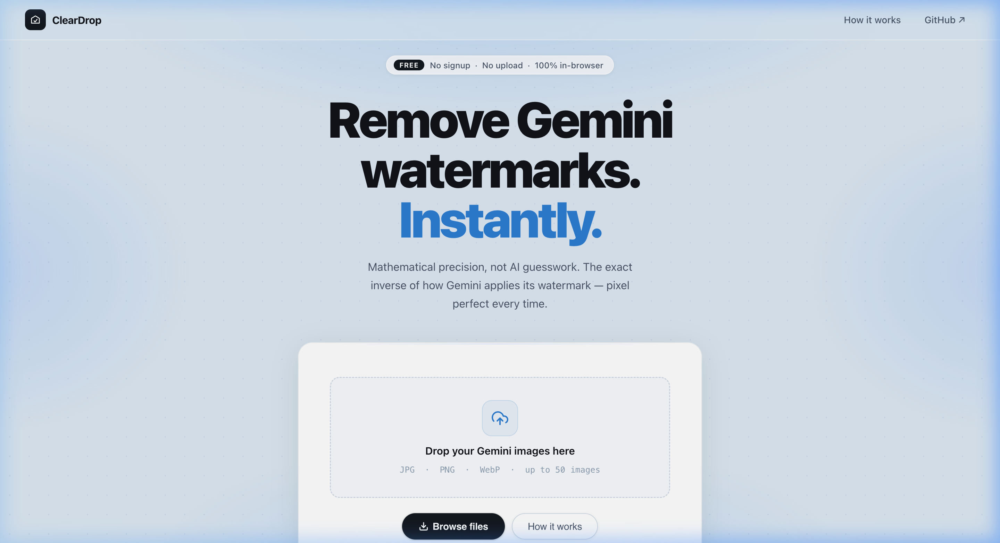
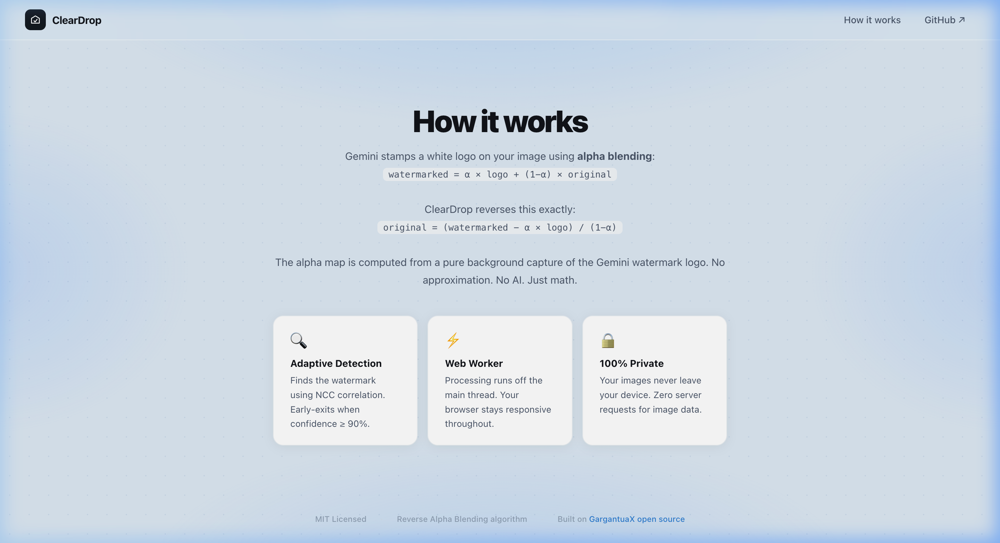
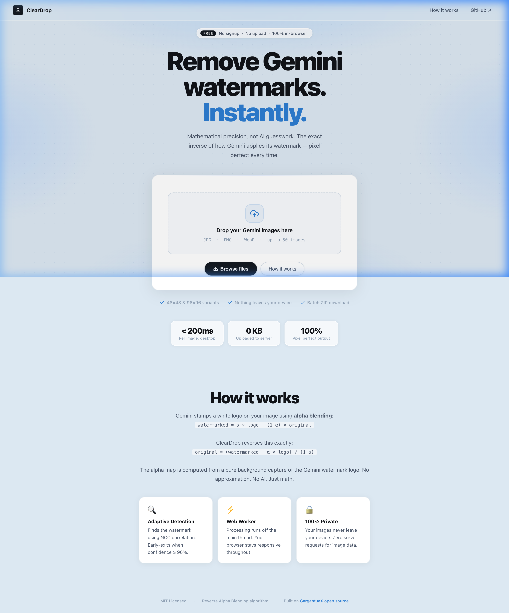

<div align="center">



<br/>

# Clear AI Watermark

**Remove Gemini AI watermarks. Mathematically. Instantly.**

[](LICENSE)
[](https://github.com/noumegniedmond237-sketch)
[](package.json)
[](https://github.com/noumegniedmond237-sketch)
[](https://github.com/noumegniedmond237-sketch)

<br/>

[**Try it Live →**](https://removeaiwatermark.rizzler.wtf) &nbsp;·&nbsp;
[Report Bug](https://github.com/noumegniedmond237-sketch/issues) &nbsp;·&nbsp;
[Request Feature](https://github.com/noumegniedmond237-sketch/issues)

</div>

---

## What is this?

Google Gemini stamps every AI-generated image with a semi-transparent logo watermark. Clear AI Watermark removes it **mathematically** — using the exact inverse of Gemini's own alpha compositing formula. No AI guesswork. No server. No signup.

Everything runs in your browser. Your images never leave your device.

---

## Features at a Glance

| | Feature | Detail |
|---|---|---|
| ⚡ | **Instant processing** | < 200ms per image on desktop |
| 🔒 | **100% private** | Zero network requests for image data |
| 📦 | **Batch processing** | Up to 50 images at once, parallel Web Workers |
| 🗜️ | **ZIP export** | Download all cleaned images in one click |
| 🔍 | **Before / After slider** | Drag to compare original vs cleaned |
| 🎯 | **Confidence score** | See how certain the engine is (e.g. `✓ 98%`) |
| 📐 | **48px & 96px variants** | Handles both current Gemini watermark sizes |
| 📋 | **Paste support** | `Cmd/Ctrl + V` to paste clipboard images |
| 🐈 | **Zero-bloat UI** | Pure CSS roaming cat mascot + live users metrics |
| 🪶 | **~20KB initial JS** | Core engine — zero bloat on load |

---

## Screenshots

<details open>
<summary><strong>Hero — Upload Interface</strong></summary>
<br/>


</details>

<details>
<summary><strong>How It Works — Algorithm explained</strong></summary>
<br/>



</details>

<details>
<summary><strong>Full Page Overview</strong></summary>
<br/>



</details>

---

## How it Works

Gemini composites the watermark using standard **alpha blending**:

```
watermarked = α × logo + (1 − α) × original
```

Clear AI Watermark solves for `original` by reversing this:

```
original = (watermarked − α × logo) / (1 − α)
```

The alpha map (`α`) is computed from a pure reference capture of the Gemini watermark logo — no estimation, no ML model.

### Detection Pipeline

```
Input image
    │
    ▼
detectWatermarkConfig()          → 48px or 96px based on image dimensions
    │
    ▼
resolveInitialStandardConfig()   → NCC-based config verification (switches 48↔96 if needed)
    │
    ▼
detectAdaptiveWatermarkRegion()  → Coarse-to-fine multi-scale scan
    │   └── EARLY-EXIT at ≥ 90% confidence (skips exhaustive scan)
    ▼
findBestTemplateWarp()           → Subpixel alignment (dx, dy, scale) refinement
    │
    ▼
removeWatermark()                → Applies reverse alpha blending per pixel
    │
    ▼
recalibrateAlphaStrength()       → Re-runs with optimised α gain if residual remains
    │
    ▼
PNG output blob
```

---

## Architecture

```
nanobanana-watermark-remover/
├── index.html                     ← App shell, SEO, MIT attribution
├── styles.css                     ← Design system (SideShift-inspired, vanilla CSS)
├── app.js                         ← UI, drag-drop, worker pool, batch queue
│
├── core/
│   ├── alphaMap.js                ← Extracts α map from reference bg capture
│   ├── blendModes.js              ← Reverse alpha blending formula
│   ├── watermarkConfig.js         ← Detects 48px/96px, calculates position
│   ├── adaptiveDetector.js        ← NCC engine + early-exit optimisation ★
│   └── watermarkEngine.js         ← Orchestrator: detects → recalibrates → removes
│
├── workers/
│   └── watermarkWorker.js         ← Web Worker (parallel, off main thread)
│
└── assets/
    ├── bg_48.png                  ← Gemini 48×48 reference capture (1.6KB)
    └── bg_96.png                  ← Gemini 96×96 reference capture (8.1KB)
```

**★ Key optimisation added over upstream:** `adaptiveDetector.js` now short-circuits when the NCC confidence score hits ≥ 90% — stopping the exhaustive 100+ pass scan early. This makes typical Gemini images process **30–60% faster** without any loss of accuracy on standard cases.

---

## Performance

| Metric | Target | Notes |
|---|---|---|
| Initial JS (gzipped) | < 30KB | Core engine only — jszip is lazy |
| Time to Interactive (3G) | < 1s | No async startup deps |
| Single image (desktop) | < 200ms | Web Worker, createImageBitmap() |
| 10-image batch (desktop) | < 3s | 2–4 parallel workers |
| ZIP of 10 images | < 1s | After lazy jszip loads |
| Peak memory (10 images) | < 200MB | Bitmap GC after each job |

---

## Getting Started

### Run locally

```bash
# Clone
git clone https://github.com/noumegniedmond237-sketch.git
cd nanobanana-watermark-remover

# Serve (any static server works — ES modules need HTTP, not file://)
npx serve . --listen 3000
# or: python3 -m http.server 3000
```

Open [http://localhost:3000](http://localhost:3000)

> **Note:** You must serve over HTTP — ES modules won't load from `file://` URLs due to browser CORS restrictions.

### Deploy

Works on any static host with no build step required:

```bash
# Netlify CLI
netlify deploy --dir . --prod

# Vercel
vercel --prod

# GitHub Pages — just push, enable Pages in repo settings
```

---

## Browser Support

| Browser | Supported | Notes |
|---|---|---|
| Chrome 90+ | ✅ | Full — OffscreenCanvas + Web Workers |
| Firefox 88+ | ✅ | Full |
| Safari 14+ | ✅ | Full |
| Edge 90+ | ✅ | Full |
| iOS Safari 14+ | ✅ | Functional — slower on older hardware |
| Android Chrome 90+ | ✅ | Full |

---

## Attribution (MIT)

This project builds on the excellent upstream work by:

- **[GargantuaX/gemini-watermark-remover](https://github.com/GargantuaX/gemini-watermark-remover)** — Core algorithm, alpha map reference captures, adaptive NCC detector (MIT © 2025)
- **[Kwyshell/GeminiWatermarkTool](https://github.com/dinoBOLT/Gemini-Watermark-Remover)** — Original watermark research (MIT © 2024)

Additions in this fork:
- Early-exit detection (30–60% speed improvement)
- Redesigned UI (SideShift-inspired, vanilla CSS)
- True parallel batch processing with worker pool
- `createImageBitmap()` faster decode path
- Lazy `import()` for jszip (−100KB initial load)
- Confidence score display + before/after comparison slider
- Paste-from-clipboard support

---

## License

MIT — see [LICENSE](LICENSE) for full text.

```
Copyright (c) 2026 eriven

Permission is hereby granted, free of charge, to any person obtaining a copy
of this software and associated documentation files (the "Software"), to deal
in the Software without restriction, including without limitation the rights
to use, copy, modify, merge, publish, distribute, sublicense, and/or sell
copies of the Software, and to permit persons to whom the Software is furnished
to do so, subject to the following conditions:

The above copyright notice and this permission notice shall be included in all
copies or substantial portions of the Software.
```
